# 검색 트리

## 트리와 이진 트리

## 용어
### 루트
- 트리는 노드들과 노드들을 연결하는 링크들로 구성됨.

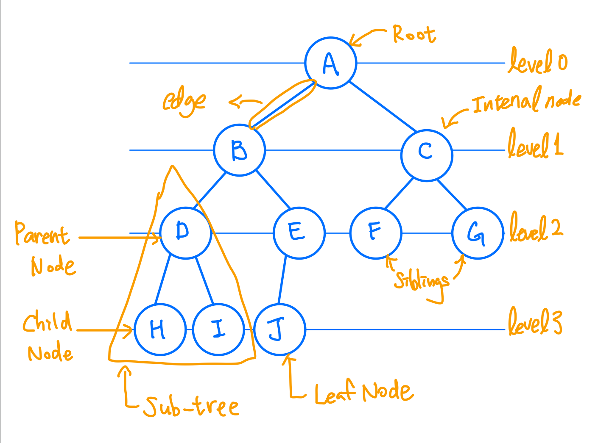
- 부모가 동일한 노들을 형제 관계라고 부름
- 루트노드를 제외한 트리의 모든 노드들은 유일한 부모 노드를 가짐.

- 리프노드가 아닌 노드들을 내부 노드라고 부름.
- 자식이 없는 노드들을 leaf노드라고 부름

### 트리의 기본적인 성직
- 노드가 N개인 트리는 항상 N-1개의 링크(link)를 가진다.
- 트리에서 루트에서 어떤 노드로 가는 경로는 유일하다. 또한 임의의 두 노드간의 경로도 유일하다

### 이진 트리
- 이진 트리에서 각 노드는 최대 2개의 자식을 가진다.
- 각각의 자식 노드는 자신이 부모의 왼쪽 자식인지 오른쪽 자식인지가 지정된다.

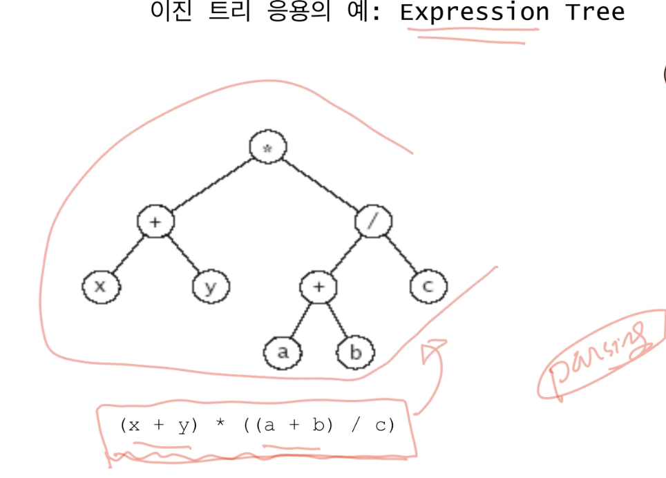

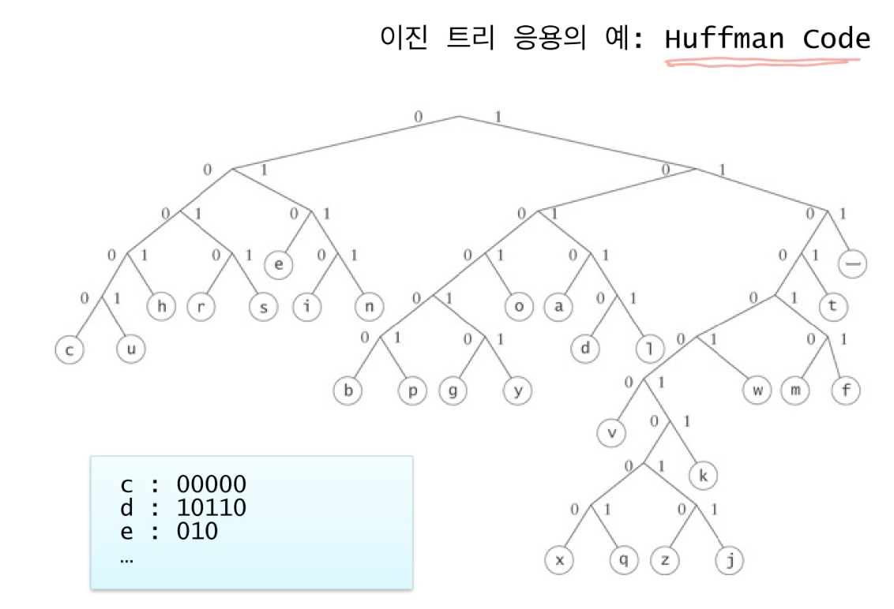
- 압축할때 허프만 코드를 사용함(각 문자를 위와같이 인코딩함)

### 이진트리의 표현
- 연결구조(Linked Structure) 표현
    - 각 노드에 하나의 데이터 필드와 왼쪽 자식, 오른쪽 자식 그리고 부모노드의 주소를 저장
    - 부모노드의 주소는 반드시 필요한 경우가 아니면 보통 생략함
    - 루트노드의 주소는 따로 보관함.
    
### 이진트리의 순회(traversal)
- 순회 : 이진 트리의 모든 노드를 방문하는 일
- 중순위 순회
- 선순위 순회
- 후순위 순회
- 레벨 오더 순회

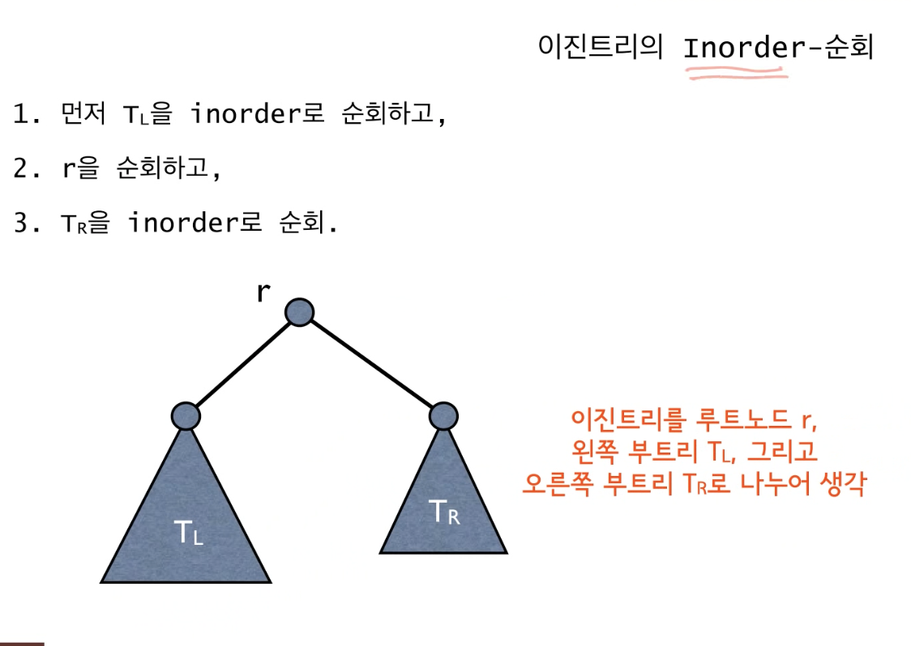

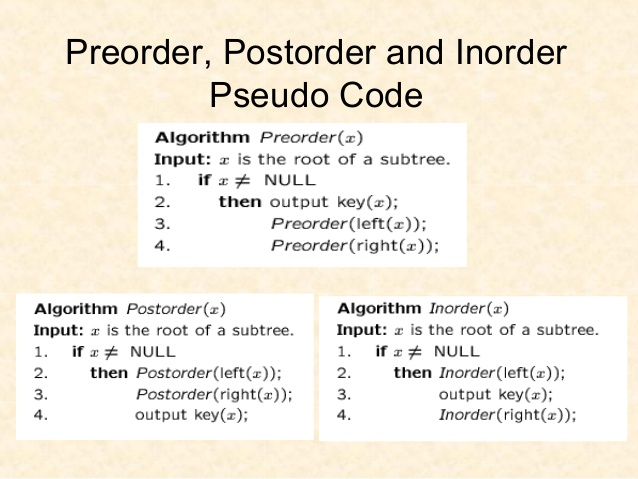

- preorder는 root -> Tl -> Tr
- Postorder  Tl -> Tr -> root

### Expression Trees
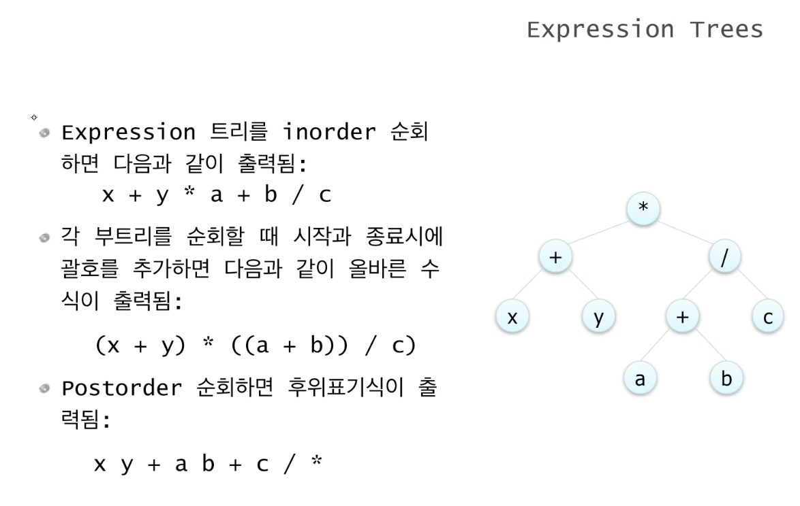

### level-order 순회
- 레벨 순으로 방문, 동일 레벨에서는 왼->오 
- 큐를 이용하여 구현
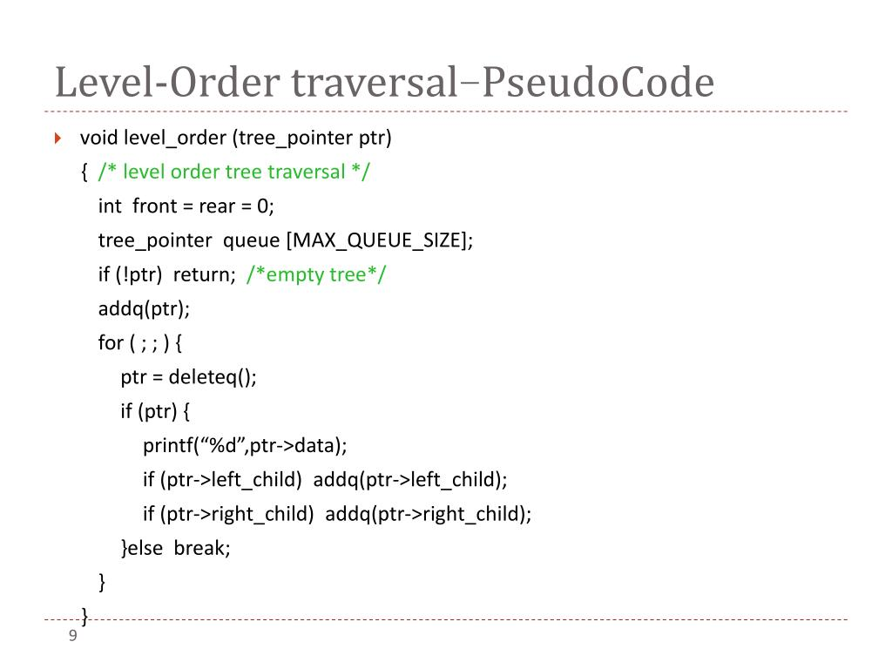
  
--- 

## 이진 검색 트리

### Dynamic Set
- 여러 개의 키를 저장
- 다음과 같은 연산들을 지원하는 자료 구조
  - INSERT - 새로운 키의 삽입
  - SEARCH - 키 탐색
  - DELETE - 키의 삭
|시간복잡도||Search|Insert|Delete| 
|--|--|--|--|--|--|
|배열|정렬|O(logn)|O(n)|O(n)|
||정렬X|O(n)|O(1),O(n)|O(1)|
|연결리스트|정렬|O(n)|O(n)|O(1)|
||정렬X|O(n)|O(1)|O(1)|
    
### 다양한 방법들
- 정렬된 혹은 정렬되지 않은 배열 혹은 연결 리스트를 사용할 경우
INSERT, SEARCH, DELETE 중 적어도 하나는 O(n)
- 이진 탐색 트리(Binary Search Tree), 레드-블랙 트리, AVL-트리 등의 트리에 기반한 구조들
- Direct Address Table, 해쉬 테이블 등

### 검색 트리
- Dynamic Set을 트리의 형태로 구현
- 일반적으로 SEARCH, INSERT, DELETE 연산이 트리의 높이에 비례하는 시간복잡도를 가짐./
- 이진검색트리, 레드-블랙 트리, B-트리 등

### 이진 검색 트리
- 이진트리이면서 각 노드에 하나의 키를 저장
- 각 노드에 대해서 그 노드의 왼쪽 부트르에 있는키들은 key[v]보다 작거나 같고, 오른쪽 부트리에 있는 값은 크거나 같다.

### Heap bst
- 힙은 complete binary tree 이여야 함. 
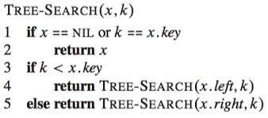
  - 시간복잡도 : O(h)
  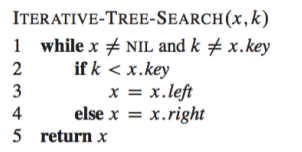
  [참고 링크](https://web.stanford.edu/class/archive/cs/cs161/cs161.1168/lecture8.pdf)

---

## 이진검색트리 2
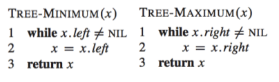

### Successor
- 노드 x의 successor란 key[x]보다 크면서 가장 작은 키를 가진 노드
- 모든 키들이 서로 다르다고 가정

#### 3가지 경우
- 노드 x의 오른쪽 부트리가 존재할 경우, 오른쪽 부트리의 최소값
- 오른쪽 부트리가 없는 경우, 어떤 노드 y의 왼쪽 부트리의 최대값이 x가 되는 그런 노드 y가 x의 succesor
  - 부모를 따라 루트까지 올라가면서 처음으로 누군가의 왼쪽 자식이 되는 노드
- 그런 노드 y가 존재하지 않을 경우 succesor가 존재하지 않음 (즉, x가 최대값)
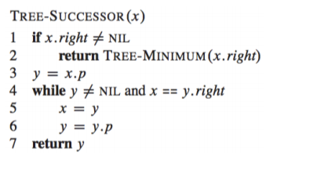
  
### Predecessor
- 노드 x의 predecessor란 key[x]보다 작으면서 가장 큰 키를 가진 노드
- Successor와 반대
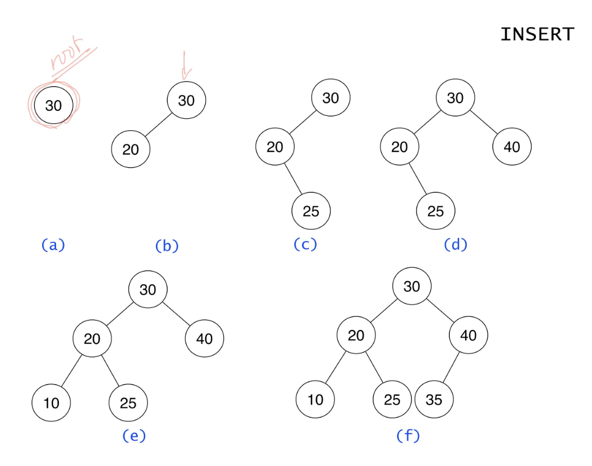
  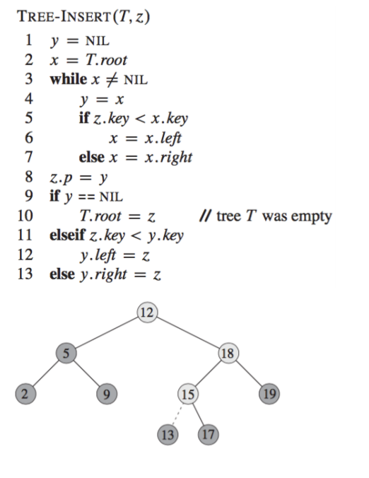
  

--- 

## DELETE

- Case 1 : 자식노드가 없는 경우 ->그냥 삭제

- Case 2 : 자식노드가 1개인 경우 -> 자신의 자식노드를 원래 자신의 위치로!

- Case 3 : 자식노드가 2개인 경우 
  - predecessor 로 변경하거나, Succesor로 변경하면 됨. 
  - 삭제하려는 노드의 succesor를 찾아서 옮겨옴.
  - 삭제하려는 노드의 successor는 최대 1개의 자식노드를 가짐.(이것이 가장 큰 핵심, 왼쪽 자식이 없으므로)
  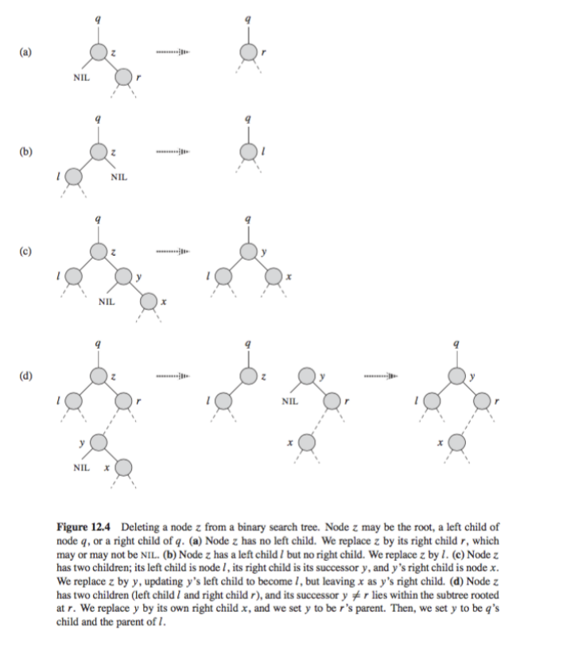
    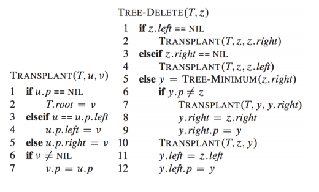
    시간 복잡도 : O(h)

### BST
- 각종 연산의 시간복잡도 O(h)
- 그러나, 최악의 경우 트리의 높이 h=O(n)
- 균형잡힌(balanced ) 트리
  - 레드-블랙 트리 등
  - 키의 삽입이나 삭제시 추가로 트리의 균형을 잡아줌으로써 높이를 O(log~2~n)으로 유지