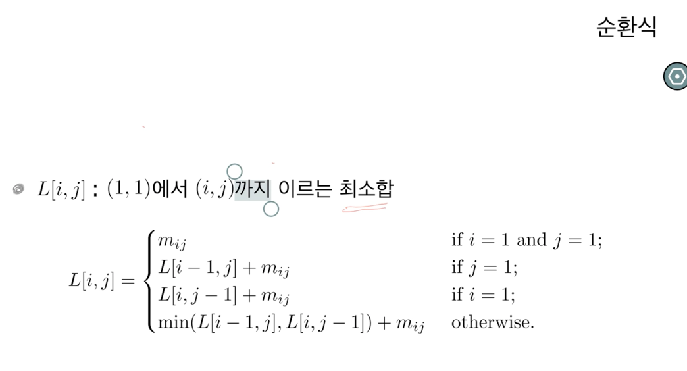

# Dynamic Programming
- 리처드 파인만이 개발하였음.

### Fibonacci Numbers
```java
int fib(int n)
{
    if(n==1 || n==2)
        return 1;
    else
        return fib(n-2)+fib(n+1);
}
```
>많은 계산이 중복된다는 문제점이 있다.

### Memoization
```java
int fib(int n)
{
    if (n==1 || n==2)
        return 1;
    else if (f[n]>-1)
        return f[n];
    else {
        f[n]=fib(n-2)+fib(n-1);
        return f[n];
    }
}
/*배열 f가 -1으로 초기화되어 있다고 가정
즉 이미 계산된 값이라는 읨
중간 계산 결과를 캐
```

### Dynamic Programming
```java
int fib(int n)
{
    f[1] = f[2]=1;
    for(int i=3; i<=n; i++)
        f[n] = f[n-1]+f[n-2];
    return f[n];
}
```
> bottom-up 방식으로 중복 계산을 피함


## 이항 계수(Binomial Coefficient)

```java
int binoial(int n, int k)
{
    if (n==k || k==0)
        return 1;
    else
        return binomial(n-1,k)+binomial(n-1,k-1);
}
```
> 역시 많은 계산이 중복됨

### Memoization
```java
int binomial(int n, int k)
{
    if(n==k||k==0)
        return 1;
    else if (binom[n][k]>-1) 
        return binom[n][k];
    else {
        binom[n][k]=binomial(n-1,k)+binomial(n-1,k-1);
        return biom[n][k];
    }
}
```
> 이 또한 bottom-up 방식으로 중복 계산을 피함

### Memoization vs Dynamic Programming
- 순환식의 값을 계산하는 기법들이다.
- 둘다 동적계획법의 일종으로 보기도 한다
- Memoization은 top-down 방식이며, 실제로 필요한 subproblem만을 푼다.
- 동적계획법은 bottom-up 방식이며, recursion에 수반되는 overhead가 없다.

--- 

##Basic Sample

### 행렬 경로 문제
- 정수들이 저장된 nXn 행렬의 좌상단에서 우하단까지 이동한다.
단 오른쪽이나 아래쪽 방향으로만 이동할 수 있다.
- 방문한 칸에 있는 정수들의 합이 최소화되도록 하라.

#### key observation
- (i,j)에 도달하기 위해서는 (i,j-1)혹은 (i-1,j)를 거쳐야 한다.
- 또한 (i,j-1) 혹은 (i-1,j)까지는 최선의 방법으로 이동해야 한다.



### Recursive Algorithm
```java
int mat(int i, int j)
{
    if (i==1 && j ==1)
        return m[i][j];
    else if (i==1)
        return mat(1,j-1)+m[i][j];
    else if (j==1)
        return mat(i-1,1)+m[i][j];
    else
        return Math.min(mat(i-1,j),mat(i,j-1))+m[i][j];
}

```
### Memoization
```java
int mat(int i, int j)
{
    if (L[i][j] != -1) return L[i][j];
    if(i == 1 && j == j)
        L[i][j]=m[i][j];
    else if (i==1)
        L[i][j]=mat(1,j-1)+m[i][j];
    else if (j==1)
        L[i][j]=mat(i-1,1)+m[i][j];
    else
        L[i][j]=Math.min(mat(i-1,j),mat(i,j-1))+m[i][j];
    return L[i][j];
}
```

### Bottom-Up
```java
int mat()
{
    for (int i=1; i<=n; i++){
        for(int j=1; j<=n; j++){
            if(i==1 && j ==1)
                L[i][j]=m[1][1];
            ekse if(i==1)
                L[i][j]=m[i][j]+L[i][j-1];
            else if(j ==1)  
                L[i][j]=m[i][j]+L[i-1][j];
            else
                L[i][j]=m[i][j]+Math.min(L[i-1][j],L[i][j-1]);
        }   
    }
    return L[n][n];
}
```

### Common Trick
```java
int mat()
{
    for (int i=1; i<=n; i++){
        for(int j=1; j<=n; j++){
            if(i==1&& j==1)
                L[i][j]=m[1][1];
            else
                L[i][j]=m[i][j]+Math.min(L[i-1][j],L[i][j-1]);
        }    
    }
    return L[n][n];
}
```

### 경로 구하기
```java
int mat()
{
    for (int i=1; i<=n; i++){
        for(int j=1; j<=n; j++){
            if(i==1&& j==1)
                L[i][j]=m[1][1];
            else
                L[i][j]=m[i][j]+Math.min(L[i-1][j],L[i][j-1]);
        }    
    }
    return L[n][n];
}
```