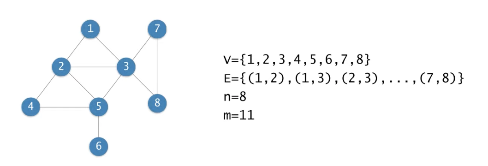

# 그래프 알고리즘

## 그래프

- (무방향) 그래프 G = (V,E)

  - V : 노드(node) 혹은 정점(vertex)
  - E : 노드쌍을 연결하는 에지 혹은 링크
  - 객체들 간의 이진관계를 표현
  - n = |V|, m = |E|

  

### 방향 그래프와 가중치 그래프

- 방향 그래프(Directed Graph) G = (V,E)
  - 엣지(u,v)는 u로부터 v로의 방향을 가짐
- 가중치 그래프
  - 엣지마다 가중치가 지정

### 그래프의 표현

- 인접 행렬(adjacency matrix)
  

### 인접 리스트

- 정점 집합을 표현하는 하나의 배열과 각 정점마다 인접한 정점들의 연결 리스트
  

  - 저장 공간 : O(n+m)
  - 어떤 노드 v에 인접한 모든 노드 찾기 : O(degree(v)) 시간
  - 어떤 에지(u,v)가 존재하는지 검사 : O(degree(u)) 시간

### 방향 그래프

- 인접 행렬은 비대칭
- 인접 리스트는 m개의 노드를 가짐

### 가중치 그래프의 인접행렬 표현

- 에지의 존재를 나타내는 값으로 1대신 에지의 가중치를 저장
- 에지가 없을 떄 혹은 대각선 :
  - 특별히 정해진 규칙은 없으며, 그래프와 가중치가 의미하는 바에 따라서
  - 예 : 가중치가 거리 혹은 비용을 의미하는 경우라면 에지가 없으면 무한대, 대각선은 0
  - 예 : 만약 가중치가 용량을 의미한다면 에지가 없을 때 0, 대각선은 무한대

### 경로와 연결성

- 무방향 그래프 G=(V,E)에서 노드 u와 노드 v를 연결하는 경로가 존재할 때 v와 u는 서로 연결되어 있다고 말함
- 모든 노드 쌍들이 서로 연결도니 그래프를 연결된 그래프라고 함.
- 연결 요소
  

---

# 그래프에서의 BFS

## 그래프 순회

- 순회(traversal)

  - 그래프의 모든 노드들을 방문하는 일

- 대표적 두가지 방법
  - BFS(Breadth-First Search, 너비우선순회)
  - DFS(Depth-First Search, 깊이우선순회)

## BFS(너비우선순회)

- BFS 알고리즘은 다음 순서로 노드들을 방문
  - L<sub>0</sub> = {s}, 여기서 s는 출발 노드
  - L<sub>1</sub> = L<sub>0</sub>의 모든 이웃 노드들
  - L<sub>2</sub> = L<sub>1</sub>의 이웃들 중 L<sub>0</sub>에 속하지 않은 노드들
    ...
  - L<sub>i</sub>- L<sub>i-1</sub>의 이웃들 중 L<sub>i-2</sub>에 속하지 않는 노드들
    

## 큐를 이용한 너비우선순회


```java
BFS(G,s)
    Q<-pi;
    Enqueue(Q,s);
    while Q != pi do
        u <- Dequeue(Q)
        for each v adjacent to u do
            if v is unvisited then
                mark V as visited;
                Enqueue(Q,v);
            end.
        end.
    end.
```

### BFS와 최단 경로

- s에서 L<sub>i</sub>에 속한 노드까지의 최단 경로의 길이는 i이다.(여기서 경로의 길이는 경로에 속한 에지의 개수를 의미한다.)
- BFS를 하면서 각 노드에 대해서 최단 경로의 길이를 구할 수 있다.
- 입력 : 방향 혹은 무방향 그래프 G=(V,E), 그리고 출발노드 S (- V
- 출력 : 모든 노드 v에 대해서
  - d[v] = s로부터 v까지의 최단 경로의 길이(에지의 개수)
  - pi[v] = s로부터 v까지의 최단경로상에서 v의 직전 노드(predecessor)

```java
BFS(G,s)
    Q<-pi;
    d[S]<-0;
    pi[s]<-null;
    Enqueue(Q,s);
    while Q != pi do
        u <- Dequeue(Q)
        for each v adjacent to u do
            if v is unvisited then
                mark V as visited;
                d[v] <-d[u]+1;
                pi[v]<-u;
                Enqueue(Q,v);
            end.
        end.
    end.
```

### 시간복잡도

```java
BFS(G,s)
    Q<-pi;
    for each node u do
        d[u]<-1;
        pi[s]<-null;
    end.
    d[S]<-0;
    pi[s]<-null;
    Enqueue(Q,s);
    while Q != pi do
        u <- Dequeue(Q)
        for each v adjacent to u do
            if v is unvisited then
                mark V as visited;
                d[v] <-d[u]+1;
                pi[v]<-u;
                Enqueue(Q,v);
            end.
        end.
    end.
```

## BFS 트리

- 각 노드 v와 pi[v]를 연결하는 에지들로 구성된 트리


너비우선순회 : 최단 경로 출력하기

```java
PRINT-PATH(G,s,v)
    if v= s then
        print s;
    else if pi[v] = null then
        print "no path from s to v exists";
    else
        print-path(G,s,pi[v]);
        print v;
end.
```

- 그래프가 연결되지 않거나 혹은 방향 그래프라면 BFS에 의해서 모든 노드가 방문되지 않을 수도 있음.

- bfs를 반복하여 모든 노드 방문

```java
BFS-ALL(G)
{
    while there exists unvisited node v
        BFS(G,v);
}
```
