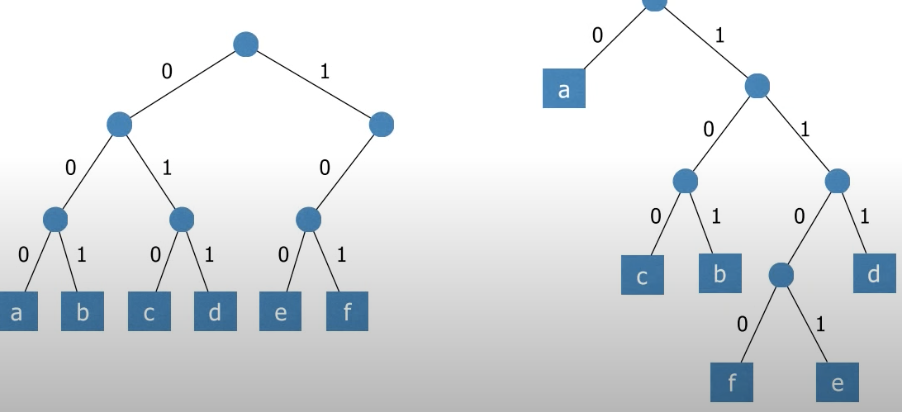
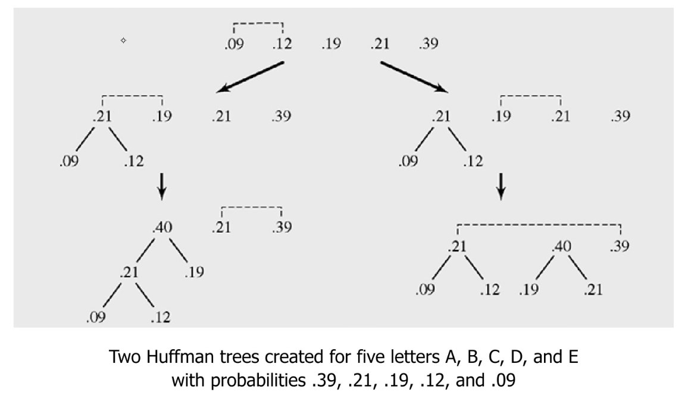
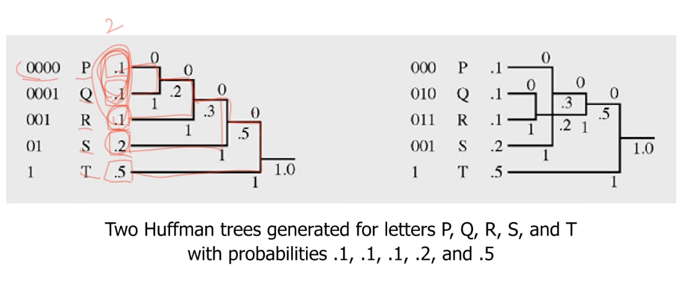
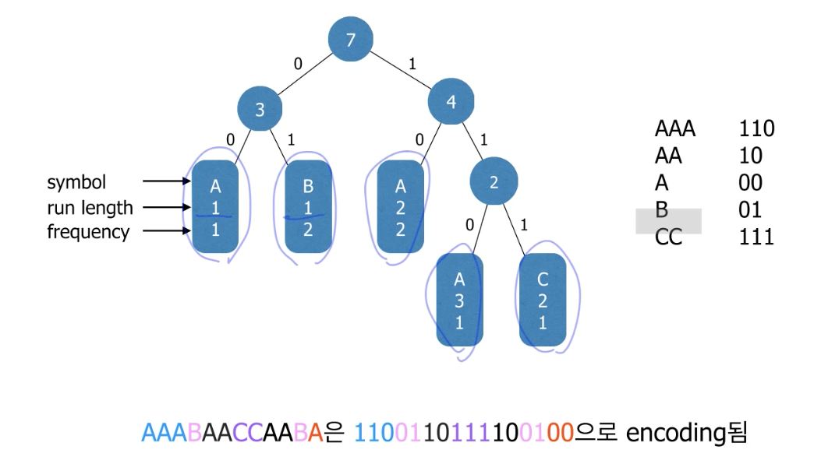
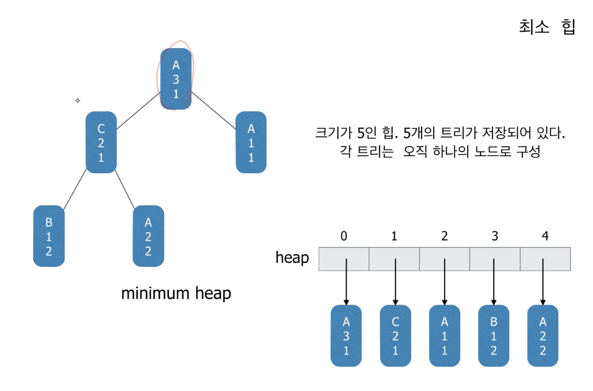

# Huffman Coding

- 무손실 압축(lossless)
- 손실 압축(lossy)

### Huffmans Coding

- 가령 6개의 문자 a,b,c,d,e,f로 이루어진 파일이 있다고 가정. 문자의 총 개수는 100,000개

|                   | a   | b   | c   | d   | e    | f    |
| ----------------- | --- | --- | --- | --- | ---- | ---- |
| Frequency         | 45  | 13  | 12  | 16  | 9    | 5    |
| Fixed-length code | 000 | 110 | 010 | 011 | 100  | 101  |
| Variable-length   | 0   | 101 | 100 | 111 | 1101 | 1100 |

- 고정길이 코드를 사용하면 각각의 문자를 표현하기 위해서 3비트가 필요하며, 300,000비트가 파일의 길이가 된다.
- 위 테이블의 가변길이 코드를 사용하면 224,000 비트가 된다.

### Prefix Code

- 어떤 codeword도 다른 codeword의 Prefix가 되지 않는 코드(여기서 codeword란 하나의 문자에 부여된 이진코드를 말함)
- 모호함이 없이 decode가 가능함
- prefix code는 하나의 이진트리로 표현 가능함
- prefix는 문자의 내부 노드가 있게 생기지 않는다!
  

### Huffmand code

- 서로 다른 문자의 코드
- 아래 숫자는 퍼센티지를 얘기함



- 왼쪽 오른쪽은 중간과정이 달라질수 있지만, 압축률은 동일하다!


> Prefix로 한것이 압축률이 최대치이다!

> 얼마나 잘 균형적으로 분배하는지가 중요하다!



### Run-Length Encoding

- 런은 동일한 문자가 하나 혹은 그 이상 연속해서 나오는 것을 의미함. 예를 들어 스트링 s = "aaabba"는 다음고 같은 3개의 run으로 구성된다 : "aaa","bb","a"/
- run-length encoding에서는 각각의 run을 그 "Run을 구성하는 문자"와 "run의 길이"의 순서쌍(n,ch)로 encoding한다. -> 3a2b1a로 인코딩한다.
- Run-length encoding은 길이가 긴 run들이 많은 경우에 효과적이다.

---

### Huffman Method with Run-length Encoding

- 파일을 구성하는 각각의 run들을 하나의 super-symbol로 본다. 이 super-symbol들에 대해서 Huffman coding을 적용한다.

ex) AAABAACCAABA

| Symbol     | A   | C   | A   | B   | A   |
| ---------- | --- | --- | --- | --- | --- |
| run length | 3   | 2   | 1   | 1   | 2   |
| frequency  | 1   | 1   | 1   | 2   | 2   |



## 제 1단계 Run과 Frequency 찾기

- 압축할 파일을 처음부터 끝까지 읽어서 파일을 구성하는 run들과 각 run들의 등장횟수를 구한다.

```java
class Run{
    byte symbol;
    int runLen;
    int freq;
}
```

- 먼저 각 run들을 표현할 하나의 클래스 class run을 정의한다. 클래스 run은 적어도 세개의 데이터 멤버 symbol, runLen 그리고 freq를 가져야 한다. 여기서 symbol은 byte타입이고, 나머지는 정수들이다.
- 인식한 run들은 하나의 ArrayList에 저장한다.
- 적절한 생성자와 equals 메서드를 구현한다.

- 데이터 파일을 적어도 두 번 읽어야 한다. 한번은 run들을 찾기 위해서, 그리고 다음은 실제로 압축을 수행하기 위해서
- 여기서는 RandomAccessFile을 이용하여 데이터 파일을 읽어본다.

```java
/*읽을 데이터 파일을 연다*/
RandomAccessFile fIn = new RandomAccessFile(fileName,"r");

/*한 byte를 읽어 온다. 읽어온 byte는 0~255 사이의 정수로 반환된다.
파일의 끝에 도달한면 -1을 반환한다.*/

int ch = fIn.read();

/*필요하다면 byte로 casting해서 저장한다*/byte symbol = (byte)ch;
```


```java
class Run{
    public byte symbol;
    public byte runLen;
    public int freq;
}
```

---

## 2단계 Huffman Tree
- Huffman coding 알고리즘은 트리들의 집합을 유지하면서
- 매 단계에서 가장 frequency가 작은 두 트리를 찾아서 두 트리를 하나로 합친다.
- 이런 연산에 가장 적합한 자료구조는 최소 힙이다.
- 즉 힙에 저장된 각각의 원소들은 하나의 트리이다.(노드가 아니라)



>하나하나가 single node tree 라서 트리들의 트리이다!

