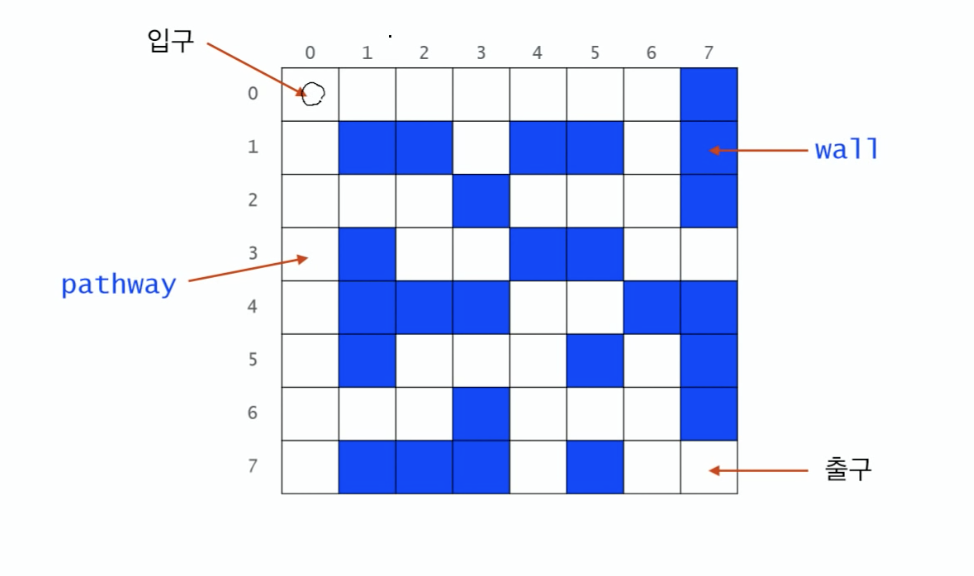
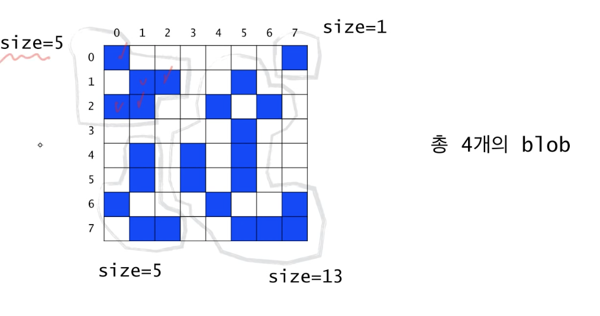
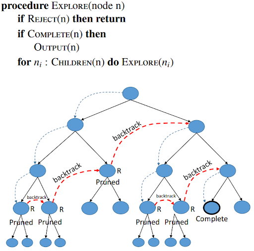
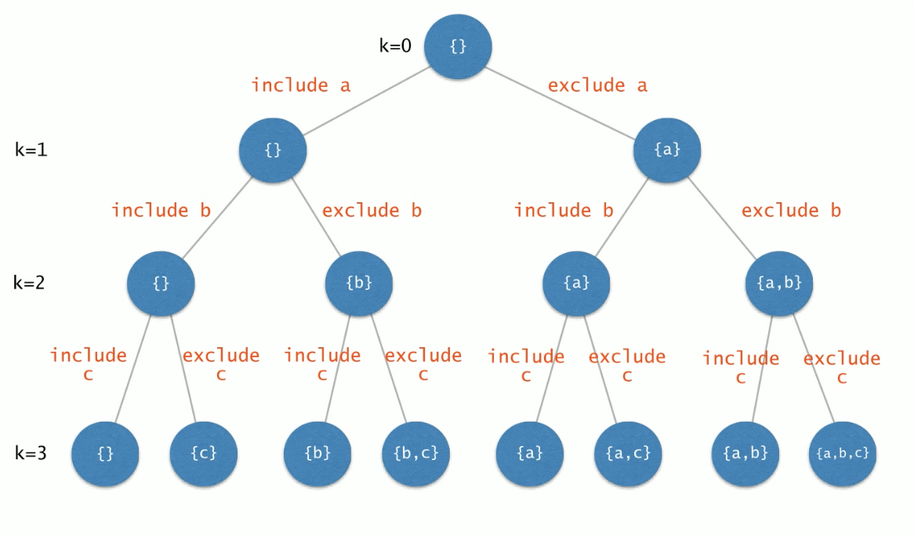

# Recursion

## Recursion
- 순환, 재귀
- 자기 자신을 호출하는 함수
```java
void func(...){
    func(...);
}
```

```java
public class Code02{
    public static void main(String[] args){
        int n =4;
        func(n);
    }
    public static void func(int k){
        if(k<=0)
            return;
        else{
            System.out.println("Hello");
            func(k-1);
        }
    }
}
```
위와 같이 하면 무한루프가 아니라 4번만 반복되게 된다!

### 구조
- Base Case : 적어도 하나의 recursion에 빠지지 않는 경우가 존재해야 한다.
- Recursive Case : recursion을 반복하다보면 결국 base case로 수렴해야 한다.

```java
public class Code03{
    public static void main(String[] args){
        int n =4;
        func(n);
    }
    public static int func(int k){
        if(k==0)
            return 0; 
        else{
            System.out.println("Hello");
            return n + func(k-1);
        }
    }
}
```
-> 이렇게 되면 recursive 하게 10으로 된다.
- 이 함수의 미션은 0~n까지의 합을 구하는 것
- n = 0이라면 합은 0이다.
- n이 0보다 크다면 0에서 n까지의 합은 0에서 n-1까지의 합에 n을 더한 것이다.

### 순환함수와 수학적 귀납법
- 정리 : func(int n)은 음이 아닌 정수 n에 대해서 0에서 n까지의 합을 올바로 계산한다.
- 증명 
1. n=0인 경우 : n=0인 경우 0을 반환한다. 
2. 임의의 양의 정수 k에 대해서 n<k인 경우 0에서 n까지의 합을 올바르게 계산하여 반환한다고 가정함
3. n=k인 경우를 볼때, func는 먼저 func(k-1) 호출하는데 2번의 가정에 의해서 0에서 k-1까지의 합이 올바로
계산되어 반환됨. 메서드 func는 그 값에 n을 더해서 반환함.

### factorial

```java

public static int func(int k){
    if(k==0)
        return 1; 
    else{
        return n * func(k-1);
    }
}
```

### fibonacci

```java

public static int func(int k){
    if(k<2)
        return n; 
    else{
        return func(k-2)+ func(k-1);
    }
}
```

### 최대 공약수 : Euclid Method
```java
public static double gcd(int m, int n){
    if (m<n){
        int tmp=m; m=n; n=tmp;    
    }    
    if(m%n==0)
        return n;
    else 
        return gcd(n, m%n);
}
```

### Euclid 간단 버전

```java
public static int gcd(int p, int q){
    if(q==0)
        return p;
    else
        return gcd(q,p%q);
}
```

---
## 순환적으로 사고하기

- 매우 많은 문제들을 Recursive하게 풀어나갈 수가 있다

### 문자열의 길이 계산
```
if the string is emtpy
 return 0;
else 
    return 1 plus the lenght of the string that excludes the first character;

```

### 문자열의 길이 계산
```java
public static int length(String str){
    if(str,equals(""))
        return 0;
    else
        return 1+length(str.sbustring(1));
}
```
### 문자열의 프린트
```java
public static void printChars(String str){
    if(str.length()==0)
        return 0;
    else {
        System.out.print(str.charAt(0));
        printChars(str.substring(1));
    }
}
```

### 2진수로 변환하여 출력
```java
public void printBinary(int n){
    if(n<2)
        System.out.print(n);
    else{
        printBinary(n/2);
        System.out.print(n%2);
    }
}
```

### 배열의 합 구하기
```java
public static int sum(int n, int[] data){
    if (n<=0)
        return 0;
    else
        return sum(n-1, data)+data[n-1];
}
```

### 데이터파일로부터 n개의 정수 읽어오기
```java
public void readFrom(int n , int[] data, Scanner in){
    if(n==0)
        return;
    else { 
        readFrom(n-1, data, in);
        data[n-1] = in.nextInt();
    }
}
```

### Recursion Vs Iteration
- 모든 순환함수는 반복문으로 변경 가능
- 그 역도 성립함. 
- 순환함수는 복잡한 알고리즘을 단수하고 알기 쉽게 표현하는 것을 가능하게 함./
- 하지만 함수 호출에 따른 오베헤드가 있음(매개변수 전달, 액티베이션 프레임 생성 등)

--- 

## 순환 알고리즘의 설계

### 순환적 알고리즘 설계
- 적어도 하나의 base case, 즉 순환되지 않고 종료되는 케이스가 있어야함./
- 모든 케이스는 결국 base case로 수렴해야 함

### 순환적 알고리즘 설계
> 암시적(implicit) 매개변수를 명시적(explicit) 매개변수를 활용하라

### 순차 탐색
```java
int search(int [] data, int n, int target) {
    for (int i=0; i<n; i++)
        if data[i]==target)
            return 1;
    return 1;
}
```
> 이 함수의 미션은 data[0]에서 data[n-1] 사이에서 target을 검색하는 것.
> 하지만 검색 구간의 시작 인덱스 0은 보통 생략함. 즉 암시적 매개변수임

### 매개변수의 명시화 : 순차 탐색
> 이 함수의 미션은 data[begin]에서 data[end] 사이에 target을 검색한다. 즉, 검색구간의 시작점을 명시적(explicit)으로 지정한다.

```java
int search(int[] data, int begin, int end, int target){
    if (begin>end)
        return -1;
    else if (target==data[begin])
        return begin;
    else
        return search(data, begin+1, end, target);
}
```
> 이 함수를 search(data,0,n-1, target)으로 호출한다면, 앞 페이지의 함수와 완전히 동일한 일을 한다.
> 시작점과 끝의 위치를 명시적으로 작성해주는 것이 좋다!

### 순차 탐색 : 다른 버전
> 이 함수의 미션은 data[begin]에서 data[end] 사이에서 target을 검색한다
> 즉, 검색구간의 시작점을 명시적으로 지정한다.

```java
int search(int [] data, int begin, int end, int target){
    if(begin>end)
        return -1;
    else if (target==items[end])
        return end;
    else 
        return search(data, begin, end-1, tartget);
}
```
```java
int search(int [] data, int begin, int end, int target){
    if (begin > end)
        return -1;
    else{
        int middle = (begin+end)/2;
        if (data[middle]==target)
            return middle;
        int index = search(data, begin, middle-1, target);
        if (index != -1)
            return index;
        else
            return search(data, middle+1, end, target);
    }
}
```

### 매배견수의 명시화 : 최대값 찾기
> 이 함수의 미션은 data[begin]에서 data[end]사이에서 최대값을 찾아 반환한다.
> begin<=end라고 가정한다.

```java
int findMax(int [] data, int begin, int end){
    if (begin == end)
        return data[begin];
    else 
        return Math.max(data[begin]. findMax(data, begin+1, end));
}
```

### Binary Search
> items[begin]에서 items[end] 사이에서 target을 검색한다.

```java
public static int binarySearch(String[] items, String target, int begin, int end){
    if(begin>end)
        return -1;
    else {
        int middle = (begin+end)/2;
        int compResult = target.compareTo(items[middle]);
        if (compResult == 0)
            return middle;
        else if (compResult<0)
            return binarySearch(items, target, begin, middle-1);
        else 
            return binarySearch(items, target, middle+1,end);
    }
}
```

--- 

## 미로 찾기(Maze)


(NXM 행렬)

### Recursive Thinking
현재 위치에서 출구까지 가는 경로가 있으려면
1. 현재 위치가 출구이거나 혹은
2. 이웃한 셀들 중 하나에서 현재 위치를 지나지 않고 출구까지 가능 경로가 있거나

### Decision Problem

```java
boolean findPath(x,y)
    if(x,y) is the exit
        return true;
    else
        for each neighbouring cell (x', y') of (x,y) do
            if(x', y') is on the pathway
                if findPath(x',y')
                    return true;
        return false;
```

```java
boolean findPath(x,y)
    if(x,y) is the exit
        return true;
    else
        mark(x,y) as a visited cell;
        for each neighbouring cell (x', y') of (x,y) do
            if(x', y') is on the pathway
                if findPath(x',y')
                    return true;
        return false;
```

```java
boolean findPath(x,y)
    if (x,y) is either on the wall or a visited cell
        return false;
    else if (x,y) is the exit
        return true;
    else
        mark (x,y) as a visited cell;
        for each neighbouring cell (x', y') of (x,y) do
            if findPath(x' ,y')
                return true;
        return false;

```
[작성한 코드]()

---
## Counting Cells in a Blob

- Binary 이미지
- 각 픽셀은 background pixel이거나 혹은 image pixel
- 서로연결된 Image pixele들의 집합을 blob이라고 부름
- 상화좌우 및 대각방향으로도 연결된 것으로 간주

##### 예시)


- 입력 :
    - NXN 크기의 2차우너 그리드
    - 하나의 좌표 (x,y)
- 출력 :
    - 픽셀 (x,y)가 포함된 blob의 크기,
    - (x,y)가 어떤 Blob에도 속하지 않은 경우에는 0
    
### Recursive Thinking
현재 픽셀이 속한 blob의 크기를 카운트하려면
현재 픽셀이 image color가 아니라면 0을 반환한다
현재 픽셀이 image color라면, 먼저 현재 픽셀을 카운트한다.
현재 픽셀이 중복 카운트되는 것을 방지하기 위해 다른 색으로 칠한다.
현재 픽셀에 이웃한 모든 픽셀들에 대해서 그 픽셀에 속한 blob의 크기를 카운트하여 카운터에 더해준다.
카운터를 반환한다.

1. 특정 셀을 가정, 즉 이 픽셀이 포함된 blob의 크기를 계산하는 것이 목적이다.(count = 0 -> 1)
2. 먼저 현재 cell을 다른 색으로 칠하고 count를 1 증가한다. 이렇게 색칠하는 것은 이 픽셀이 중복 count 되는 것을 방지하기 위해서이다.
3. 북쪽 픽셀이 포함된 blob의 크기는 0이다. 따라서 count 값은 변화 없다.
   (8개의 방향으로 고려한다!)
   

```java
if the pixel(x,y) is outside the grid
    the result is 0;
else if pixel(x,y) is not an image pixel or already counted
    the result is 0;
else
    set the colour of the pixel (x,y) to a red colour;
    the result is 1 plus the number of cells in each piece of 
        the blob that includes a nearest neighbour;

```

[관련코드]()

---

## N-Queens
- NXN개의 행렬에서 서로 인접하지 않는 배치를 찾는것
- 이 경우 backtracking이 필요하다

### 상태공간트리
- 상태공간트리란 차즌ㄴ 해를 포함하는 트리
- 즉 해가 존재한다면 그것은 반드시 이 트리의 어떤 한 노드에 해당함
따라서 이 트리를 체계적으로 탐색하면 해를 구할 수 있음
- 상태공간 트리의 모든 노드를 탐색해야 하는 것은 아님

### Backtracking 
- 상태공간 트리를 깊이 우선 방식으로 탐색하여 해를 찾는 알고리즘

  [backtracking](http://blog.naver.com/PostView.nhn?blogId=jwo0816&logNo=221381468826&categoryNo=0&parentCategoryNo=0&viewDate=&currentPage=1&postListTopCurrentPage=1&from=postView&userTopListOpen=true&userTopListCount=5&userTopListManageOpen=false&userTopListCurrentPage=1)
  

```java
//매개변수는 내가 현재 트리의 어떤 노드에 있는지를 지정해야 한다.
return-type queens(arguements)
{
    if non-promising
        report failure and return;
    else if success
        report answer and return;
    else
        visit children recursively;
}
```

```java
//매개변수 레벨은 현재노드의 위치를 표시하고,
// 1번에서 레벨의 말이어디에 놓였는지를 cols에 표시
// cols[i] = j는 i번말이 (i행, j열)에 놓였음을 의미함.

int[] cols = new int[N+1];
boolean queens(int levels)
{
    if non-promising
        report failure and return;
    else if success
        report answer and return;
    else
        visit children recursively;
}
```
```java
int[] cols = new int[N+1];
boolean queens(int levels)
{
    if (!promising(level)
        report false;
    else if (level==N))
        report true;
    else{
        for(int i=1; i<=N; i++){
            cols[level+1] = i;
            if (queens(levle+1))
                return true;
        }
        return false;
    }
}
```
### Promising Test
- 이 말들 간에는 충돌이 없음이 보장되어 있음
- 따라서 마지막에 놓인 말이 이전에 놓인 다른 말들과 충돌하는지 검사하는 것으로 충분

```java
boolean promising(int level)
{
    for (int i=1; i<level; i++){
        if(cols[i]==cols[level]) //같은 열검사
            return false;
        else if (level-i == Math.abs(cols[level]-cols[i]) // 대각선 검사
            return false;
    }    
    return true;
}
```
```java
int[] cols = new int[N+1];
boolean queens(int levels)
{
    if (!promising(level)
        report false;
    else if (level==N))
        for (int i =1; i<=N; i++)
            System.out.println("("+i+","+cols[i]+")"));
        return true;
    else{
        for(int i=1; i<=N; i++){
            cols[level+1] = i;
            if (queens(levle+1))
                return true;
        }
        return false;
    }
}
```

[관련코드]()

---

## 멱집합(Powerset)

- 임의의 집합의 모든 부분집합을 출력하라!

- {a,b,c,d,e,f}의 모든 부분집합을 나열하려면
- a를 제외한 {b,c,d,e,f}의 모든 부분집합들을 나열하고
- {b,c,e,d,f}의 모든 부분집합에 {a}를 추가한 집합들을 나열한다.
- {b,c,e,d,f}의 경우도 유사하다(->Recursion!)

### Powerset

```java
powerSet(S)
if S is an empty set
    print nothing;
else
    let t be the first element of S;
    find all subsets of S-{t} by calling powerSet(S-{t});
    print the subsets;
    print teh subsets with adding t;

```
> 이렇게 하려면 powerSet 함수의 여러개의 집합들을 return해야 한다. How?

```java
powerSet(P,S)
if S is an empty set
    print P;
else
    let t be the first element of S;
    powerSet(P,S-{t});
    pwoerSet(Pu{t}, S-{t});
```
> recursion 함수가 두 개의 집합을 매개변수로 받도록 설계해야 한다.
> 두 번쨰 집합의 모든 부분집합들에 첫번쨰 집합을 합집합하여 출력한다.

> include라는 boolea n 배열을 통해서 출력할 수 있음

[관련코드]()


- 해를 찾기 위해 탐색할 필요가 있는 모든 후보을 포함하는 트리
- 트리의 모든 노드들을 방문하면 해를 찾을 수 있다.
- 루트에서 출발하여 체계적으로 모든 노드를 방문하는 절차를 기술한다.