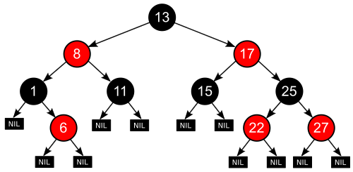
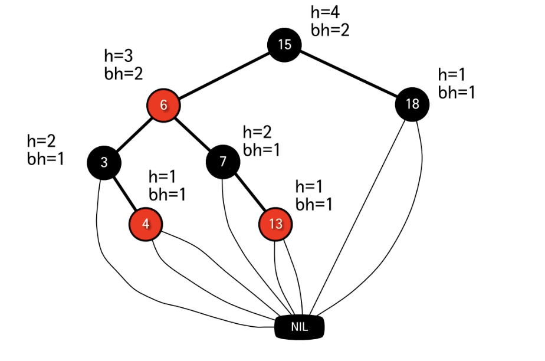
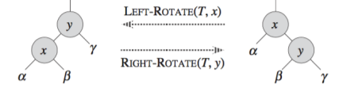
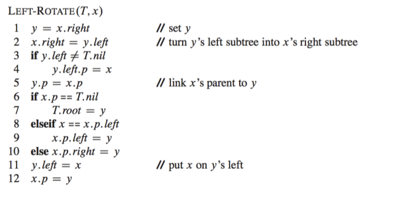

# RED-BLACK TREE

## BST
- Search
- Insert
- Delete

### 레드 - 블랙 트리
- 이진탐색트리의 일종
- 균형잡힌 트리 : 높이가 O(log2n)
- Search, Insert, Delete 연산을 최악의 경우에도 O(log2n 시간에 지원)

### 레드 블랙 트리

- 각 노드는 하난의 키, 왼쪽 자식, 오른쪽 자식, 그리고 부모노드의 주소르 저장
- 자식노드가 존재하지 않을 경우 NIL 노드라고 부르는 특수한 노드가 있다고 가정
- 따라서 모든 리프노드는 NIL 노드
- 루트의 부모도 NIL노드라고 가정
- 노드들은 내부노드와 NIL노드로 분류

### 정의 
- 다음의 조건을 만족하는 이진탐색트리 :
    - 각 노드는 red 혹은 black이고,
    - 로트노드는 black이고,
    - 모든 리프노드는 black 이고,
    - Red 노드의 자식노드들은 전부 black이고
    - 모든 노드에 대해서 그 노드로부터 자손인 리프노드에 이르는 모든 경로에는 
      동일한 개수의 black 노드가 존재한다.
      
### 레드 - 블랙 트리의 높이
- 노드 x의 *높이 h(x)*는 자신으로부터 리프노드까지의 가장 긴 경로에 포함된 엣지의 개수이다.
- 노드 x의 *블랙-높이 bh(x)*는 x로부터 리프노드까지의 경로상의 블랙노드의 개수이다.
  (노드 x 자신은 불포함)
  
  
- 높이가 h인 노드의 블랙-높이는 bh>=h/2이다.
    - 조건 4에 의해 레드노드는 연속될 수 없으므로 당연
- 노드 x를 루트로 하는 임의의 부트리는 적어도 2bh(x)-1개의 내부노드를 포함한다.(수학적 귀납법)
- n 개의 내부노드를 가지는 레드블랙트리의 높이는 2log(n+1)이하이다.
    - n>=2bh-1>=2h/2-1이므로, 여기서 bh와 h는 각각 루트 노드의 블랙-높이 와 높이

### 결론
- 이진탐색트리의 일종
- 균형잡힌 트리 : 높이가 O(log2n)
- Search, Insert, Delete 연산을 최악의 경우에도 O(log2n)시간에 지원

### Left and Right Rotation
- 시간복잡도 O(1)
- 이진탐색트리의 특성을 유지 

  
### leftrotate pseudocode

- y = right[x] =! NIL라고 가정
- 루트노드의 부모도 NIL라고 가정
[참고링크](https://web.stanford.edu/class/archive/cs/cs161/cs161.1168/lecture8.pdf)

  

