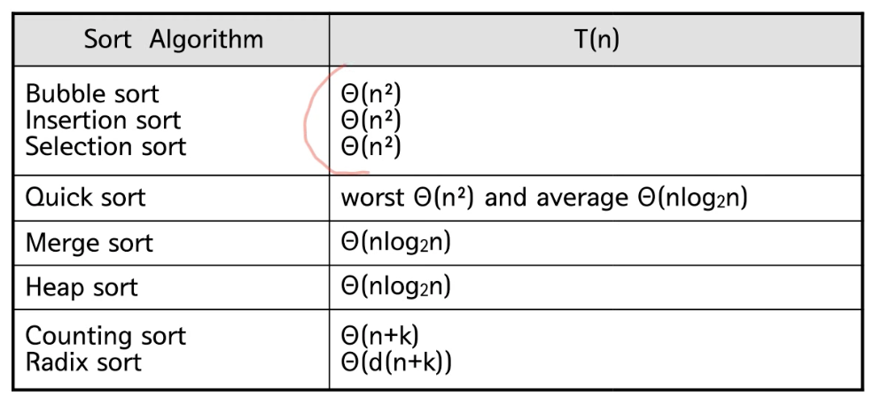
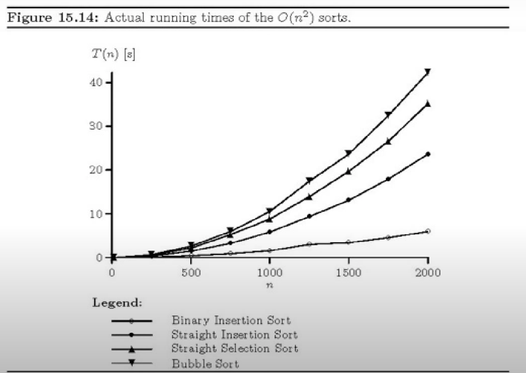

# 정렬

: 가장 기본적인 알고리즘 중 하나이다. 

|정렬|설명|
|--|--|
|버블 정렬||
|삽입 정렬||
|선택 정렬||
|퀵 정렬||
|머지 정렬||
|힙 정렬||
|Radix 정렬||

## 기본적인 정렬 알고리즘
- 각 루프 마다 
    - 최대의 원소를 찾는다.
    - 최대 원소와 맨 오른쪽 원소를 교환한다.
    - 맨 오픈쪽 왼소를 제외한다.
- 하나의 원소만 남을 때까지 위의 루프를 반복


## 선택 정렬
- 가장 큰값을 바꾸고, 마지막 자리와 바꾼다.
- 계속해서 반복하다보면, 전체적으로 오른차순으로 정렬하게 된다.

```java
selectionSort(A[], n){
    for last <- downto 2 {
        A[1...last] 중 가장 큰 수 A[k]를 찾는다;
        A[k] <->A[last]; -> 교환
    }
}

```

- 실행시간 : 
1) 1 의 for 루프는 n-1번 반복
2) 2에서 가장 큰 수를 찾기위한 비교 횟수는 n-1,~,1
3) 3의 교환은 상수시간 작업
- 시간 복잡도
T(n) = (n-1)+...+1 = O(n^2^)

## 버블 정렬
- 가장 큰값을 구하기 까지 서로 인접하는 값을 오른차순으로 정렬해가면서
끝까지 간다는데 선택정렬과 다른점이 있다.(한 턴에서 바꾸는 작업을 상당히 많이함!)
  
```java
bubbleSort(A[],n)
{
    for last <- n down 2 {
        for i <- 1 to last-1
            if (A[i]>A[i+1]) then A[i] <-> A[i+1];
    }            
}
```

- 수행 시간 : 
1) 1의 for 루프는 n-1번 반복
2) 2의 for 루프는 각각 n-1~1번 반복
3) 3의 교환은 상수시간 작업

T(n) = (n-1)+~+1 = O(n^2^)

## 삽입정렬


-첫 두개부터 정렬하고 정렬된 것에 하나하나씩 추가하면서 정렬 과정을 반복하여 전체를 정렬하는 과정이다.
1) item to insert
2) copy the item to tmp
3) compare
4) shift
5) compare
6) shift
7) finally insert

-> 앞에서부터 비교하는지, 뒤에서부터 비교하는지 차이가 있을 수 있다.
-> 이것이 array인 경우도 있지만 LinkedList인 경우도 있어서, 조회하는데 다를 수 있다.

```java
insertionSort(A[], n){
    for i<-2 to n {
        A[1,,n]의 적당한 자리에 A[i]를 삽입한다.
        }    
}
```

- 수행시간 
1) 1의 for 루프는 n-1번 반복
2) 2의 삽입은 최악의 경우 i-1번 비교
- 최악의 경우 : 
T(n) = (n-1)+~+1 = O(n^2^)
  
--- 
## 분할정복법(Divide and Conquer)

- mergesort, quicksort가 이에 해당함

- 분할 : 해결하고자 하는 문제를 작은 크기의 동일한 문제들로 분할
- 정복 : 각각의 작은 문제를 순환적으로 해결
- 합병  : 작은 문제의 해를 합하여 원래 문제에 대한 해를 구함.

## 합병 정렬

- 데이터가 저장된 배열을 절반으로 나눔
- 각각을 순환적으로 정렬
- 정렬된 두 개의 배열을 합쳐 전체를 정렬
  (Divide -> Recursively sort -> merge)
- 이미 정복된 것은 정렬된 상태이므로, 분할된 배열을 i,j 합쳐진 배열을 k로 할당하여 비교해가면 붙여나간다.
```java
mergeSort(A[], p, r) { //처음이 p, 끝이 r
    if(p<r) then{
        q <- (p+q)/2;
        mergeSort(A, p, q);
        mergerSort(A, q+1, r);
        merge(A,p,q,r);
    }
}
merge(A[], p, q, r)
{
    정렬되어 있는 두 배열 A[p...q]와 A[q+1...r]을 합하여
    정렬된 하나의 배열 A[p...r]을 만든다.    
}
```
```java
void merge(int data[], int p, int q, int r){
    int i=p, j=q+1, k=p;
    int tmp[data.length()];
    whie (i<=q && j <=r){
        if (data[i]<=data[j])
            tmp[k++]=data[i++];
        else
            tmp[k++]=data[j++];
    }
    while(i<=q)
        tmp[k++]=data[i++];
    while(j<=r)
        tmp[k++]=data[j++];
    for(int i=p; i<=r; i++)
        data[i]=tmp[i];
}
```

유일한 흠이라면 추가 공간이 필요하다는 것!(tmp[])

T(n) = O(nlogn) -> 잘게 쪼개다 보면 log~2~n을 n회차 하게 되서

## QuickSort

- 분할 : 배열을 다음과 같은 조건이 만족되도록 두 부분으로 나눈다. 
elements in lower parts <= elements in upper parts
- 정복 : 각 부분을 순환적으로 정렬한다.
- 합병 : nothing to do

- pivot을 하나 설정하고, 작은 것은 왼쪽, 큰것은 오른쪽에 정렬에 위치 시킨다.
- Pivot을 설정하기에 따라 속도나 성능이 달라질 수 있음.
- 그렇기에 합병할 필요가 없어진다.

```java
quickSort(A[], p,r)
{
    if(p<r)then {
        q = partition(A,p,r);
        quickSort(A,p,q-1);
        quickSOrt(A,q+1,r);
    }           
}
partition(A[],p,r)
{
    배열 A[p...r]의 원소들을 A[r]을 기준으로 양쪽으로 재배치하고
    A[r]이 자리한 위치를 return 한다.
}
```

## Partition

if A[j]>=x
  j<-j+1;
else
  i<-i+1;
  exchange A[i] and A[j];
  j<-j+1;
```java
Partition(A,p,r)
{
    x<-A[r];
    i<-p-1;
    for j<-p to r-1
    if A[j] <= x then
        i<-i+1;
        exchange A[i] and A[j];
    exchange A[i+1] and A[r];
    return i+1;
}
```

### 퀵정렬 최악의 경우
- 항상 한쪽은 0개, 다른쪽은 n-1개로 분할되는 경우
T(n) = $$ \theta(n^2^) $$
- 이미 정렬된 입력 데이터(마지막 원소를 피봇으로 선택하는 경우)

### 퀵정렬 최선의 경우
- 항상 절반으로 분활되는 경우
T(n) =$$ \theta(nlogn) $$
  
### 퀵정렬 - 1/10 정도 분할된다면?
T(n) = O(nlog~10~n)

---

## 평균 시간 복잡도
- 평균 혹은 기대값이란? 
A(n) = $$ \sigma p(I)T(I)
- 그러나 확률인 p(I)는 미지수, 적절한 가정을 한 후 분석해야함.
- 예 : 모든 입력 인스턴스가 동일한 확률을 가진다면
p(I)= 1/n!
  
### Pivot의 선택
- 첫번쨰 값이나 마지막 값을 피봇으로 선택 
  - 이미 정렬된 데이터 혹은 거꾸로 정렬된 데이터가 최악인 경우
  - 현실의 데이터는 랜덤하지 않으므로 정렬된 데이터가 입력으로 들어올 가능성은 매우 높음
- Median of Three
  - 첫번쨰 값과 마지막 값, 그리고 가운데 값 중에서 중간값을 피봇으로 선택
  - 최악의 경우 시간복잡도가 달라지지는 않음
- Randomized Quicksort
  - 피봇을 랜덤하게 선택 
  - no worst case instance, but worst case execution
  - 평균 시간 복잡도 O(NlogN)
  
---
## Heap과 Heapsort

### Heapsort
- 최악의 경우 시간복잡도 O(nlog~2~n)
- Sorts in place - 추가 배열 불필요
- 이진 힙(binary heap) 자료구조를 사용

### Heap 이란

Heap은 complete binary tree이면서, heap property를 만족해야

- max heap property : 부모는 자식보다 크거나 같다
- min heap property : 부모는 자식보다 작거나 같다.


full은 완전히 차 있다면, complete는 마지막을 제외하고 다 차있는 것임!

- 힙 속성을 만족하지 않으면 nonheaps
- 동일한 데이터를 갖더라도 다를 수 있음. 힙은 유일하지 않음

### Heap의 표현

- 힙은 일차원 배열로 표현가능 : A[1..n]
  - 루트 노드 A[1].
  - A[i]의 부모 = A[i/2]
  - A[i]의 왼쪽 자식 = A[2i]
  - A[i]의 오른쪽 자식 = A[2i+1]
  - Complete binary tree이기 때문에 자식이 누구인지 바로 알수가 있다
  
### Max-Heapify

- 전체를 힙으로 만들어라
  - 트리의 전체 모양은 Complete binary tree로 가정함
  - 유일하게 루트만이 heap property를 만족안함
  - 왼쪽 부트리는 그 자체로 힙이고
  - 오른쪽 부트리도 그 자체로 힙일때!
  - 두 자식들 중 더 큰쪽이 나보다 크면 exchange한다! (이 중 큰 값을 선택함!)
  
### Recursive version

```java
MAX-Heapify(A,i)
{
    if there is no child of A[i]
        return;
    k <- index of the biggest child of i;
    if A[i]>= A[k]
        return;
    exchange A[i] and A[k];
    MAX-HEAPIFY(A,k);
}
```

- root 노드에 대한 heapify는 MAX-HEAPIFY(1)을 호출하면 됨.

### iterative version
```java
MAX-HEAPIFY(A,i)
{
    while A[i] has a child do
        k <- index of the biggest child of i;
        if A[i] >= A[k]
            return;
        exchange A[i] and A[k];
        i = k;
}
```

### 정렬한 배열을 힙으로 만들기

BUILD-MAX-HEAP(A)
1 heap-size[A] <- length[A]
2 for i <- [length[A]/2] downto 1
3   do MAX-HEAPIFY(A,i)

시간복잡도 : O(n)

### Heapsort
- 주어진 데이터로 힙을 만든다.
- 힙에서 최대값(루트)을 가장 마지막 값과 바꾼다.
- 힙의 크기가 1 줄어든 것으로 간주한다. 즉, 가장 마지막 값은 힙의 일부가 아닌 것으로 간주한다.
- 루트노드에 대해서 HEAPIFY(1)한다.
- 2~4번을 반복한다.

### Heapsort와 시간복잡도

HEAPSORT(A)
1. BUILD-MAX-HEAP(A)              :O(n)
2. for i <-heap_size downtpo 2 do : n-1 times
3.    exchange A[1] <->A[i]       : O(1)
4.    heap_size <- heap_size - 1  : O(1)
5.    MAX-HEAPIFY(A,1)            : O(log~2~n)

Total time : O(nlog~2~n)

--- 

## 힙의 다른 응용 : 우선 순위 큐
- 최대 우선순위 큐 (maximum priority queue)는 다음의 두 가지 연산을 지원하는 자료구조
  - INSERT(x) : 새로운 원소 x를 삽입
  - EXTRACT_MAX() : 최대값을 삭제하고 반환
- 최소 우선순위 큐(minimum priority queue)는 EXTRACT-MAX대신 EXTRACT-MIN을 지원하는 자료구조
- MAX HEAP을 이용하여 최대 우선순위 큐를 구현

### Insert

15를 추가하고 싶은 경우, 마지막 자리에만 노드를 추가할 수 있음. 15를 마지막에 넣는 경우, 문제가 생기므로 바꿔가면서 프로퍼티에 맞도록 하면 된다.

```java
MAX-HEAP-INSERT(A, key){
    heap_size = heap_size+1;
    A[heap_size]=key;
    i = heap_size;
    while(i>1 and A[PARENT(i)] < A[i]){
        exchange A[i] and A[PARENT(i)];
        i = PARENT(i); 
    }
}
```

### EXTRACT_MAX()


```java
HEAP-EXTRACT-MAX(A)
    if heap-size[A] < 1
        then error "heap underflow"
    max <- A[1]
    A[1] <- A[heap-size[A]]
    heap-size[A] <-heap-size[A]-1
    MAX-HEAPIFY(A,1)
    return max
```
시간복잡도 O(log~2~n)

---

## 정렬의 lower bound

### Comparison Sort


### 정렬 알고리즘의 유형
- Comparison Sort 
  - 데이터들간의 상대적 크기관계만을 이용해서 정렬하는 알고리즘
  - 따라서 데이터들간의 크기 관계가 정의되어 있으면 어떤 데이터에든 적용 가능(문자열, 알파벳, 사용자 정의 객체)
  - 버블소트, 삽입정렬, 합볍정렬, 퀵소트, 힙정렬 등
- Non-Comparison sort
  - 정렬한 데이터에 대한 사전지식을 이용 - 적용에 제한
  - Bucket sort
  - Radix Sort
  
### 정렬문제의 하한
- 하한 (lower bound)
  - 입력된 데이터를 한번씩 다 보기 위해서 최소 $$ \theta(n) $$의 시간복잡도 필요
  - 합병정렬과 힙정렬 알고리즘들의 시간복잡도는 $$ \theta(nlog~2~n)$$
  - 어떤 comparison sort 알고리즘도 $$ \theta(nlog~2~n)보다 나을 수 없다. $$
  
### Decision Tree
- 비교 기준에 따라서 상이한 정렬 결과를 만들어 낼수 있다. 

- n개인 경우 n!로 갖음. 왜냐하면 모든 순열(permutation)에 해당하므로
- 최악의 경우 시간복잡도는 트리의 높이
- 트리의 높이는 
  - height >= log2n! = $$ \theta(nlog2n)$$

---

## 선형시간 정렬 알고리즘

### Sorting in Linear Time

- Counting Sort
  - n 개의 정수를 정렬하라. 단 모든 정수는 0에서 k사이의 정수이다.
  - 예 : n명의 학생들의 시험점수를 정렬하라. 단 모든 점수는 100점 이하의 양의 정수이다.
  


A라는 정렬에, C라는 counter 정렬을 통해서, 정렬을 만들 수 있다.

C를 통해 00223335로 나오는 것을 볼 수 있음! 

### Counting Sort

```java
int A[n];
int C[k] = {0,};
for (int i=1; i<=n; i++)
    C[A[i]]++;
for (int s=1; i=0; i<=k; i++){
    for(int j=0; j<C[i]; j++){
        A[s++] = j;
    }
}
```

Is it okay?
No. 대부분의 경우 정렬할 key 값들은 레코드의 일부분이기 때문


### 시간 복잡도
- $$\theta(n+k)$$, 또는 $$\theta(n)$$ if k =o(n).
- k가 클 경우 비 실용적
- Stable 정렬 알고리즘
  - 입력은 동일한 값이 있을 때 입력에 먼저 나오는 값이 출력에서도 먼저 나온ㄷ
  - Counting 정렬은 stable 하다.

--- 

## Radix Sort
- n개의 d자리 정수들
- 가장 낮은 자리수부터 정렬


-> 매 정렬마다 하는 것이 stable sort

```java
RADIX-SORT(A,d)
for i <- 1 to d
    do use a stable sort to sort array A on digit i
```
시간 복잡도 O(d(n+k))


## 비교 그래프





---

# Java에서의 정렬

### 기본 타입 데이터의 정렬
- Array 클래스가 primitive 타입 데이터를 위한 정렬 메서드를 제공
  ```java
    int [] data = new int [capacity];
    // data[0]에서 data[capacity-1]까지 데이터가 꽉 차있는 경우에는 다음과 같이 정렬.
    Arrays.sort(data);
    // 배열이 꽉차있지 않고 data[0]에서 data[size-1]까지
    // size개의 데이터만 있다면 다음과 같이 해야 한다.
    Arrays.sort(data, 0, size);
  ```
- int 이외이 다른 primitive 타입 데이터(double, char 등)에 대해서도 제공

### 객체의 정렬 : 문자열

```java
String[] fruits = new String[] { "pineapple", "apple","orange","banana"};
Arrays.sort(fruits);
for(String name: fruits)
    System.out.println(name);
```
- Primitive 타입 데이터와 마찬가지로 Arrays.sort 메서드로 정렬된다.

### ArrayList 정렬 : 문자열 
```java
List<String> fruits = new ArrayList<string>();
fruits.add("pineapple");
fruits.add("apple");
fruits.add("orange");
fruits.add("banana");
Collections.sort(fruits);
for(String name:fruits)
    System.out.println(name);
```
- Collections.sort 메서드로 정렬된다.

### 객체의 정렬 : 사용자 정의 객체


-> 사용자가 순서를 정의해줘야 한다!


-> CompareTo를 Overriding해서 여기서는 이름 순으로 정렬하게 한다!


-> 재고 수량으로 결정할수 도 있다. 

## 두가지를 동시에 정렬하고 싶다면?
- 하나의 객체 타입에 대해서 2가지 이상의 기준으로 정렬을 지원하려면 Comparator를 사용


- 두가지 정렬을 선택할 수가 있다


- static 클래스로 설정하여 원하게 조절 가능하다!


